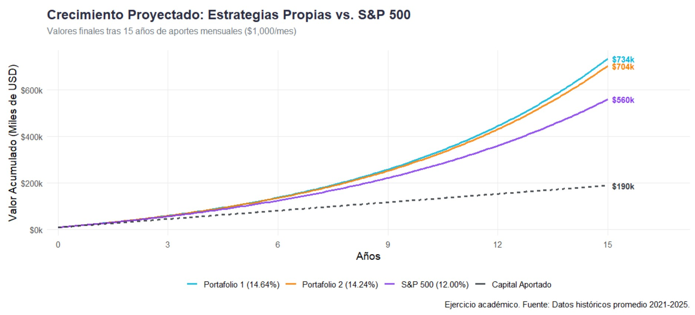

# Portfolio-distribution
Compared the portfolio results based on the annual return of last 5 years

# 📈 Simulador de Interés Compuesto y DCA: Análisis de Portafolios vs S&P 500

Este proyecto es un ejercicio netamente académico de ciencia de datos aplicado a las finanzas personales. Su objetivo principal es modelar y visualizar el impacto a largo plazo del interés compuesto y la estrategia de promediamiento de costo en dólares (DCA - Dollar Cost Averaging) mediante la comparación de diferentes estructuras de portafolio frente al rendimiento histórico del mercado total.

## 🎯 Objetivo del Proyecto

El análisis busca demostrar matemáticamente cómo pequeñas variaciones en la tasa de rendimiento anual (CAGR) y la diversificación sectorial pueden generar brechas significativas en la acumulación de capital a lo largo de un horizonte de inversión de 15 años.

Se evalúan tres escenarios:
* **Portafolio 1:** Estrategia Core enfocada en crecimiento y semiconductores, manteniendo una base del mercado total estadounidense (SPYG 35%, SMH 20%, BRK.B 20%, IEMG 15%, VTI 10%).
* **Portafolio 2:** Estrategia con mayor concentración en crecimiento y mercados emergentes, excluyendo el mercado total (SPYG 40%, SMH 20%, BRK.B 20%, IEMG 20%).
* **Portafolio 3 (Benchmark):** Rendimiento histórico aproximado del S&P 500 (~12% anual).

## 📊 Histórico de Rendimientos por Activo (Últimos 5 Años)

Para el cálculo de esta simulación, se utilizaron los retornos históricos anuales (al cierre de diciembre) de los últimos 5 años (2021 - 2025) para cada uno de los activos que componen las estrategias.

| Activo / ETF | Sector / Índice | 2021 | 2022 | 2023 | 2024 | 2025 |
| :--- | :--- | :--- | :--- | :--- | :--- | :--- |
| **SMH** | Semiconductores | 42.14% | -33.52% | 73.37% | 39.08% | 49.17% |
| **SPYG** | S&P 500 Growth | 32.01% | -29.42% | 30.02% | 35.99% | 22.08% |
| **BRK.B**| Berkshire Hathaway| 29.57% | 4.00% | 15.77% | 25.49% | 10.85% |
| **VTI** | Total Stock Market| 25.72% | -19.50% | 26.03% | 23.75% | 17.14% |
| **IEMG** | Mercados Emergentes| -0.64% | -19.87% | 11.31% | 6.92% | 32.12% |

## ⚖️ Ponderación y Rendimiento Anual por Portafolio

A continuación, se detalla la estructura de pesos de cada portafolio y el cálculo de su rendimiento anual ponderado, multiplicando el retorno de cada activo por su peso correspondiente en la estrategia.

| Activo | Peso Portafolio 1 | Peso Portafolio 2 |
| :--- | :--- | :--- |
| **SPYG** | 35% | 40% |
| **SMH** | 20% | 20% |
| **BRK.B**| 20% | 20% |
| **IEMG** | 15% | 20% |
| **VTI** | 10% | 0% |

### 📈 Rendimiento Total Anual Ponderado

| Año | Portafolio 1 | Portafolio 2 | Diferencia (P1 vs P2) |
| :--- | :--- | :--- | :--- |
| **2021** | 28.02% | 27.02% | +1.00% |
| **2022** | -21.13% | -21.65% | +0.52% |
| **2023** | 32.63% | 32.10% | +0.53% |
| **2024** | 28.92% | 28.69% | +0.23% |
| **2025** | 26.26% | 27.26% | -1.00% |
| **Media Aritmética (5 Años)** | **18.94%** | **18.68%** | **+0.26%** |

*Nota aclaratoria: La media aritmética mostrada en esta tabla representa el promedio simple de los rendimientos anuales. Para la proyección a 15 años descrita al inicio del proyecto, se utiliza la Tasa de Crecimiento Anual Compuesta (CAGR), la cual ajusta la volatilidad (como la caída del 2022) arrojando tasas reales de 14.64% para P1 y 14.24% para P2.*

## 🛠️ Tecnologías y Herramientas

* **Lenguaje:** R
* **Librerías principales:** * `ggplot2` (Visualización de datos de alto nivel).
    * `tidyr` (Manipulación y estructuración de datos en formato *long*).
    * `scales` (Formateo de escalas financieras y porcentuales).

## 🧮 Metodología y Fórmulas

La simulación se construye utilizando la fórmula de valor futuro (Future Value) para interés compuesto con aportaciones periódicas, adaptada para capitalización mensual:

$$FV = PV(1 + r)^n + PMT \left[ \frac{(1 + r)^n - 1}{r} \right]$$

**Parámetros base de la simulación:**
* **Capital Inicial (PV):** $10,000 USD
* **Aporte Mensual (PMT):** $1,000 USD
* **Horizonte de tiempo (n):** 15 años (180 meses)

## 🚀 Cómo ejecutar el proyecto

1. Asegúrate de tener instalado R y RStudio (o tu entorno preferido).
2. Clona este repositorio:
   ```bash
   git clone [(https://github.com/Andalejo1109/Portfolio-distribution/)]
   
3. Instala las dependencias necesarias ejecutando en la consola de R:

R
install.packages(c("ggplot2", "tidyr", "scales"))
Ejecuta el script principal simulador_portafolios.R.

## 📊 Resultados y Visualización

El script genera un gráfico de líneas comparativo que ilustra la curva exponencial del capital acumulado mes a mes. Se incluye una línea base de "Total Aportado" ($190,000 USD al final del periodo) para aislar visualmente la ganancia neta generada exclusivamente por el efecto del interés compuesto.

Captura de pantalla del gráfico generado por R.


## ⚠️ Disclaimer

Este repositorio y el código contenido en él tienen fines única y exclusivamente educativos y académicos. 

Los rendimientos históricos utilizados en la simulación no son garantía de resultados futuros. 

La inversión en mercados financieros conlleva riesgos de pérdida de capital. 

Toda decisión de inversión debe basarse en un análisis de riesgo individual.

✒️ Autor
[Alejandro Rodriguez / andalejo1109] - Data Scientist - [LinkedIn: (https://www.linkedin.com/in/andalejo/)]
