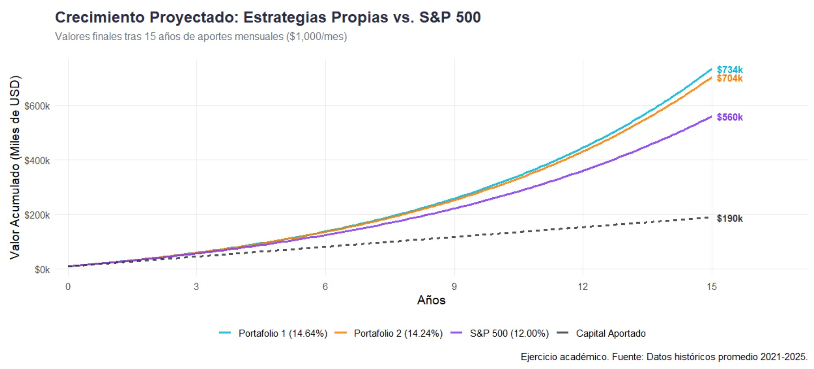

# Portfolio-distribution

[](https://etoro.tw/4lkmjxn)
[](https://bullaware.com/etoro/Andalejo1109)
[](https://andalejo1109.github.io/faq.html)

Comparación de resultados de portafolio a partir del rendimiento anual de los últimos 5 años. La tesis en vivo está en [eToro @Andalejo1109](https://etoro.tw/4lkmjxn).

## Preguntas frecuentes sobre el portafolio @Andalejo1109 en eToro

### ¿Quién es @Andalejo1109 en eToro y cuál es su perfil profesional?
Andrés Alejandro Rodríguez Lozano, economista y científico de datos en Bogotá. Popular Investor Elite en eToro. Auditor digital en detección de fraude y profesor de analítica en la Universidad Sergio Arboleda.

### ¿Qué riesgo tiene la estrategia de @Andalejo1109 y qué caídas (drawdowns) puedo esperar?
Risk score 4. 100% renta variable ($SPYG $SMH $BRK.B $IEMG $VTI), 0% apalancamiento, sin margin call. En un año tipo 2022 el mix puede caer ~20%. Las caídas recientes de 5–6% no son el techo.

### ¿Cómo copiar el portafolio en eToro y cuál es el horizonte recomendado?
3 años mínimo; tesis 5–10. Copiar operaciones abiertas. US$1.000–2.000 para no fragmentar las cinco patas. Aportes mensuales (DCA). No es asesoría.

Texto completo: [andalejo1109.github.io/faq.html](https://andalejo1109.github.io/faq.html)

---

# Simulador de interés compuesto y DCA: portafolios vs S&P 500

Ejercicio académico de ciencia de datos aplicado a finanzas personales.

## Objetivo

Mostrar cómo variaciones pequeñas en la CAGR abren brechas grandes de capital en 15 años.

- **Portafolio 1:** SPYG 35%, SMH 20%, BRK.B 20%, IEMG 15%, VTI 10%.
- **Portafolio 2:** SPYG 40%, SMH 20%, BRK.B 20%, IEMG 20%.
- **Portafolio 3:** S&P 500 (~12% anual).

## Histórico de rendimientos por activo (2021–2025)

| Activo | 2021 | 2022 | 2023 | 2024 | 2025 |
| :--- | :--- | :--- | :--- | :--- | :--- |
| **SMH** | 42.14% | -33.52% | 73.37% | 39.08% | 49.17% |
| **SPYG** | 32.01% | -29.42% | 30.02% | 35.99% | 22.08% |
| **BRK.B** | 29.57% | 4.00% | 15.77% | 25.49% | 10.85% |
| **VTI** | 25.72% | -19.50% | 26.03% | 23.75% | 17.14% |
| **IEMG** | -0.64% | -19.87% | 11.31% | 6.92% | 32.12% |

CAGR usada en la proyección (incluye 2022): **14.64%** (P1) y **14.24%** (P2).

## Cómo ejecutarlo

```bash
git clone https://github.com/Andalejo1109/Portfolio-distribution.git
```

En R: `install.packages(c("ggplot2", "tidyr", "scales"))` y ejecuta `simulador_portafolios.R`.



## Disclaimer

Fines educativos. Los rendimientos históricos no garantizan resultados futuros. Invertir implica riesgo de pérdida de capital.

## Autor

**Andrés Alejandro Rodríguez Lozano (@Andalejo1109)** — Data Scientist & eToro Popular Investor.
